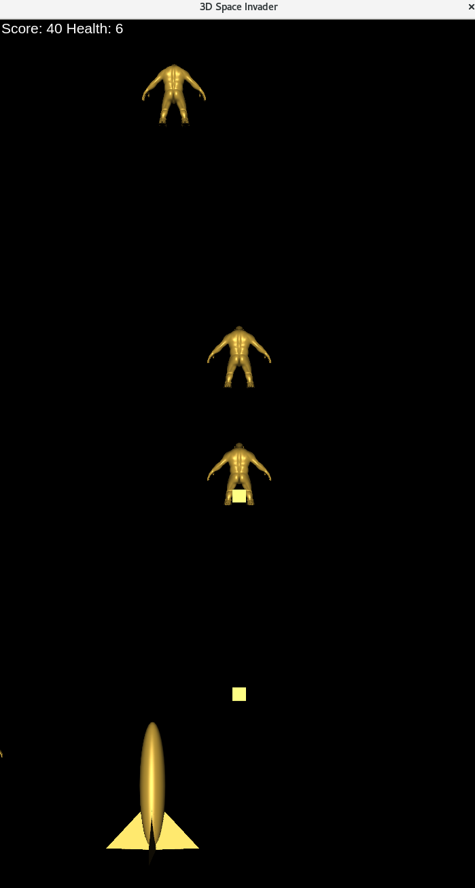

## 3D Space Shooter

---

This project is based on [GameKeyControl](https://github.com/NCCA/AdvancedGameKeyControl). 
The inspiration of this Project is from: [How To Make a Space Shooter in 20 Minutes(Godot Engine)](https://youtu.be/qd0UTOQ_la8?si=2K4Nh4uwkipLyo0s)
I followed this video's class design pattern and rewrote it in C++. 
### Gameplay

---

The player uses the _**arrow-keys**_  to control a spaceship. The spaceship can only move in two dimensions. The player can press _**space**_ to fire a laser. The player needs to use the laser to kill the space troll. If the space troll reaches the bottom of the window, the player will lose 1 HP. The game is over when the player's HP reaches zero.

---

### Code Structure

---
**SpaceShip Class:**
This class handles player health and collision detection for lasers and the spaceship itself. The collision detection function will take the target object and calculate the distance using the target position and self-position. It will return if the distance is less than the collision sphere's radius. Then according to the result, it decreases the player's health.

**Laser Class:**
This class contains the `draw` and `update` functions for the laser object. The `draw` function will be called inside the Spaceship class once it shoots, and the `update` function will be called in the Spaceship class once it is instantiated. This is the base class for **EnemyLaser**.

**EnemyLaser Class:**
It is derived from the Laser class. This laser will only move down the screen.

**Enemy Class:**
The base class of all enemy classes. It contains functions like `draw`, `update` and `collision` detection. It also handles `spawn` position, `death`, and `hit` state.

**SineWaveEnemy Class:**
The subclass of Enemy class. This enemy will move they x position in sine wave pattern. The construct will take three more parameter than base class. To control amplitude ,frequency and timer.

**ShootingEnemy Class:**
The subclass of Enemy class. Every time interval it will shoot an EnemyLaser straight down. 

**NGLScene:**
This source file handles every class above. `paintGL` handles every `draw` function. In `timerEvent`, it calculates and passes the delta time to every `update` function. It also handles game states like score and enemy vector array.

---

### Possible Improvement:

---

There is only one shader for every object. I could write shaders for each enemy type and spaceship. I can potentially add background texture to the game.

---

### Build

---

#### requirement:
`c++ compiler supporting C++17`
`Qt5 or Qt6`
`NGL (NCCA Graphics Library)`
`vcpkg`

to build use:
```
mkdir build
cd build
cmake -DCMAKE_TOOLCHAIN_FILE=[vcpkg toolchain location] ..
cmake --build .
```
### The video is in image/gameplayer.mp4


https://github.com/NCCA/cfgaa24programingassignment-JiumingGo/assets/152978699/0b075d1f-73d7-4fe0-9d91-1c62772e10af


